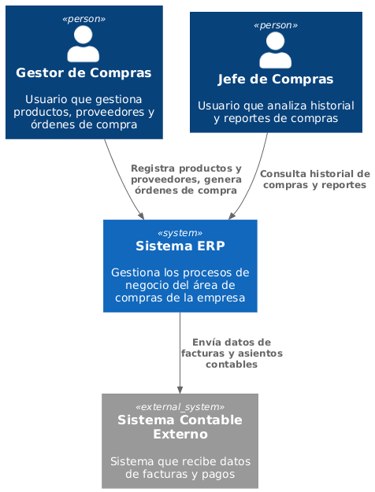
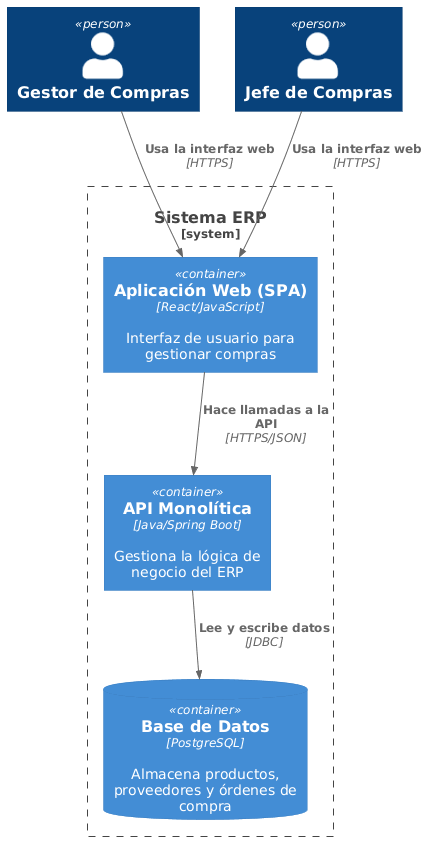
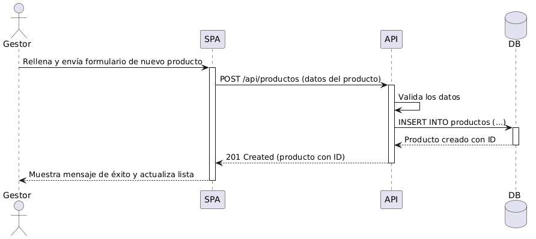

# Acerca de arc42

arc42, La plantilla de documentación para arquitectura de sistemas y de software.

Por Dr. Gernot Starke, Dr. Peter Hruschka y otros contribuyentes.

Revisión de la plantilla: 7.0 ES (basada en asciidoc), Enero 2017

© Reconocemos que este documento utiliza material de la plantilla de
arquitectura arc42, <https://www.arc42.org>. Creada por Dr. Peter
Hruschka y Dr. Gernot Starke.

# 01. Introducción y Metas

## Objetivo del Sistema ERP - Módulo de Compras

El sistema ERP del Módulo de Compras tiene como objetivo centralizar y automatizar los procesos de adquisición de productos de la empresa, mejorando la eficiencia, confiabilidad y control de inventarios y proveedores.

## Requisitos de Negocio

- Registrar productos con información básica (nombre, descripción, unidad de medida).
- Gestionar proveedores y sus datos de contacto.
- Asociar productos a proveedores y precios.
- Crear y registrar órdenes de compra.
- Consultar historial de órdenes de compra para análisis y reportes.

## Metas de Calidad

- Sistema confiable y sin pérdida de datos.
- Interfaz amigable para los gestores.
- Procesamiento rápido de solicitudes de compra.

## Partes interesadas (Stakeholders)

+------------------+----------------+----------------------------+
| Rol/Nombre       | Contacto       | Expectativas              |
+==================+================+============================+
| Gestor de Compras| correo@empresa | Registrar productos y proveedores fácilmente |
+------------------+----------------+----------------------------+
| Jefe de Compras  | correo@empresa | Analizar historial de compras y reportes     |
+------------------+----------------+----------------------------+
| Analista de Compras| correo@empresa | Gestionar proveedores y precios              |
+------------------+----------------+----------------------------+

# 02. Restricciones de la Arquitectura

- Backend: Java con Spring Boot
- Frontend: SPA con React/JavaScript
- Base de datos: PostgreSQL
- Comunicación: HTTPS/JSON entre frontend y backend
- Arquitectura: Monolítica simple para el Módulo de Compras

# 03. Alcance y Contexto del Sistema

## Contexto de Negocio

El ERP del Módulo de Compras interactúa con usuarios internos (gestores y jefes de compras) y sistemas externos de contabilidad para formalizar la adquisición de productos y mantener datos actualizados.

## Contexto Técnico

- SPA: Interfaz web que los usuarios utilizan para registrar productos y órdenes.
- API Monolítica: Gestiona la lógica de negocio y procesa solicitudes del frontend.
- Base de datos PostgreSQL: Almacena productos, proveedores, relaciones y órdenes de compra.

# 05. Vista de Bloques

## Diagrama de Contenedores

## Responsabilidad de los Contenedores

- **SPA (Aplicación Web):** Permite a los usuarios interactuar con el sistema para registrar productos, gestionar proveedores y crear órdenes de compra.
- **API Monolítica:** Procesa todas las solicitudes, valida datos y realiza operaciones sobre la base de datos.
- **Base de Datos (PostgreSQL):** Almacena productos, proveedores, relaciones y órdenes de compra.

# 06. Vista de Ejecución

## Escenario Crítico: Registrar un Producto

1. El gestor completa el formulario de nuevo producto en la SPA.
2. La SPA envía los datos a la API mediante POST /api/productos.
3. La API valida los datos y los inserta en la base de datos.
4. La base de datos devuelve el ID del producto creado.
5. La API responde a la SPA con estado 201 Created.
6. La SPA muestra un mensaje de éxito y actualiza la lista de productos.

# 07. Vista de Despliegue

- La SPA se despliega en un servidor web (NGINX o similar).
- La API Monolítica corre en un servidor de aplicaciones Java/Spring Boot.
- La base de datos PostgreSQL puede estar en el mismo servidor o en un servidor dedicado.
- Todo el tráfico es seguro mediante HTTPS.

# 10. Glosario

+------------------+-------------------------------------------+
| Término          | Definición                                |
+==================+===========================================+
| Producto         | Bien o artículo que se puede comprar.    |
+------------------+-------------------------------------------+
| Proveedor        | Entidad que suministra productos.        |
+------------------+-------------------------------------------+
| Orden de Compra  | Documento que formaliza la adquisición. |
+------------------+-------------------------------------------+
| Gestor de Compras| Usuario que registra productos y órdenes.|
+------------------+-------------------------------------------+
| Jefe de Compras  | Usuario que analiza historial y reportes.|
+------------------+-------------------------------------------+

